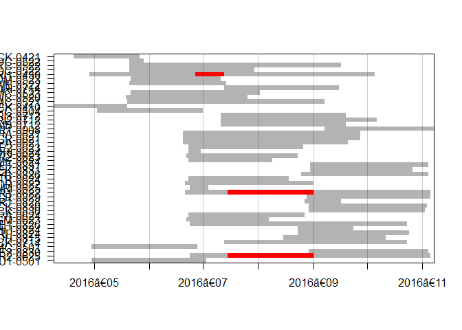

Thesis Task 2 Code: Occupancy Analysis
================
burkeprw
November 15, 2017

First, load packages.

``` r
suppressPackageStartupMessages(library(tidyverse))
suppressPackageStartupMessages(library(lubridate))
suppressPackageStartupMessages(library(readr))
suppressPackageStartupMessages(library(forcats))
suppressPackageStartupMessages(library(camtrapR))
suppressPackageStartupMessages(library(unmarked))
```

### Step 1: Read Covariate Data in Wide Format for `unmarked`

The first step is to set up an unmarked frame containing detection history and covariates for each species and functional group. The site data and detection histories are saved in [data\_copy](https://github.com/burkeprw/rsh_connectivity/tree/master/data_copy).

The record table is created using the `camptrapR:recordTable()` which reads image metadata (including species codes) directly from image files using the free software `ExifTool` and `digiKam`. Code for extracting this information and writing detection histories to file can be found in [01\_analysis\_camtrapR\_20170717.R](https://github.com/burkeprw/rsh_connectivity/blob/master/r_scripts/t2_occupancy/01_analysis_camtrapR_20170717.R).

I made the following edits to "ct\_gncesites\_2017-07jul15.csv" using ArcGIS to extract raster values at sample locatoins:
- added topographic ruggedness (TRI\_STRM)
- added years since fire, based on
- added fire severity (zs\_MEAN) - added landcover

``` r
sites <- read_csv("C:/Users/prwb/Documents/_research_projects/prj_1601ubc_gnce_connectivity/methods/00_github_rsh_connectivity/data_copy/ct_gncesites_2017-07jul15.csv", col_names = TRUE, na = c("", "NA")) 
sites_df <- ungroup(sites) %>%
  as.data.frame(sites)

#sites$deploy_date <- as.Date(sites$deploy_date, "%Y-%m-%d")
#sites_2016$lastimg_date <- as.Date(sites_2016$lastimg_date , "%Y-%m-%d")
```

Next we will look at the distribution of sampling periods across time. Sampling occurred during the snow-free months between 2016-Apr-10 and 2016-Nov-07 when wildfire are most likely.

``` r
det_op <- data.frame(lapply(sites_df, as.character), stringsAsFactors=FALSE)

detop <- cameraOperation(CTtable = det_op,           
                                   stationCol = "Station",
                                   setupCol = "deploy_date",
                                   retrievalCol = "lastimg_date",
                                   writecsv = FALSE,
                                   hasProblems = TRUE,    #TEMP     
                                   dateFormat = "%Y-%m-%d"
                                   )

camopPlot <- function(camOp){
  which.tmp <- grep(as.Date(colnames(camOp)), pattern = "01$")
  label.tmp <- format(as.Date(colnames(camOp))[which.tmp], "%Y‐%m")
  at.tmp <- which.tmp / ncol(camOp)
  image(t(as.matrix(camOp)), xaxt = "n", yaxt = "n", col = c("red", "grey70"))
  axis(1, at = at.tmp, labels = label.tmp)
  axis(2, at = seq(from = 0, to = 1, length.out = nrow(camOp)), labels = rownames(camOp), las = 1)
  abline(v = at.tmp, col = rgb(0,0,0, 0.2))
  box()
}
camopPlot(camOp = detop)
```



Next I set up observation and site covariate data frames. I create a list of the camera sampling stations in alphabetical order. Then I read in covariates for camera effort (total number of days per occassion; "ObsCovs\_effort\_scaled.csv") and visibility (measure of linear distance sampled in fromt of the camera sensor; "ObsCovs\_vist\_wt.csv").

``` r
stations <- c("CT-3-DEGU1-0501", "CT-27-COCR2-0625", "CT-28-REPE2-0830", "CT-115-LAMC-0501", "CT-115-WHCK-0714",
              "CT-133-WUDH-0815", "CT-283-STRF-0824", "CT-286-SHFI-0824", "CT-287-RAME1-0826", "CT-287-MCGM-0623",
              "CT-288-SOPA-0624", "CT-305-HZCK-0830", "CT-306-FMCK-0830", "CT-450-LSTR1-0828", "CT-474-FLCR-0829", 
              "CT-479-COCR1-0622", "CT-483-SIRI-0625", "CT-539-BUOR-0622", "CT-540-RLTR-0624", "CT-541-RBFI1-0826",
              "CT-544-RECK-0831", "CT-544-REPE1-0831", "CT-565-HIME-0624", "CT-566-SOCR2-0623", "CT-570-BORI-0624", 
              "CT-570-RAME2-0623", "CT-672-EAPA-0621", "CT-675-GRCR-0621", "CT-755-MTHA-0621", "CT-761-WFMR1-0908", 
              "CT-1168-PAIB-0712", "CT-1168-PARI2-0712", "CT-1168-PARI3-0712", "CT-1240-PAFC-0504", "CT-1262-POCK-0410", 
              "CT-1374-SUMC-0521", "CT-1390-SOWC-0520", "CT-1465-EIMC-0523", "CT-1501-CORI-0714", "CT-1596-WIWE-0522", 
              "CT-1597-LODM-0523", "CT-1598-PARI1-0430", "CT-1599-COOC-0522", "CT-1600-PETC-0522", "CT-1602-HEOC-0522", 
              "CT-1605-BOCK-0421" )

effort <- read_csv("C:/Users/prwb/Documents/_research_projects/prj_1601ubc_gnce_connectivity/methods/00_github_rsh_connectivity/data_copy/ObsCovs_effort_scaled.csv", col_names = TRUE, na = c("", "NA"))
```

    ## Parsed with column specification:
    ## cols(
    ##   .default = col_double(),
    ##   X1 = col_character()
    ## )

    ## See spec(...) for full column specifications.

``` r
effort <- effort[ -c(1)] # remove column with station name
effort_df <- ungroup(effort) %>%
  as.data.frame(effort)

visib <- read_csv("C:/Users/prwb/Documents/_research_projects/prj_1601ubc_gnce_connectivity/methods/00_github_rsh_connectivity/data_copy/ObsCovs_vist_wt.csv", col_names = TRUE, na = c("", "NA"))
```

    ## Parsed with column specification:
    ## cols(
    ##   .default = col_integer(),
    ##   X1 = col_character(),
    ##   o1 = col_double(),
    ##   o2 = col_double(),
    ##   o3 = col_double(),
    ##   o4 = col_double(),
    ##   o5 = col_double(),
    ##   o6 = col_double(),
    ##   o7 = col_double(),
    ##   o8 = col_double(),
    ##   o9 = col_double(),
    ##   o10 = col_double(),
    ##   o11 = col_double()
    ## )
    ## See spec(...) for full column specifications.

``` r
visib <- visib[ -c(1)] # remove column with station name
#visib.z <- scale(visib) # standardize
visib_df <- as.data.frame(visib)

siteCovs <- sites[ ,c("cc_oc","TRI_STRM","yrsinc_FIRE","zs_MEAN","landcover","elev")]

cc_oc.z <- scale(siteCovs$cc_oc)
TRI_STRM.z <- scale(siteCovs$TRI_STRM)
yrsinc_FIRE.z <- scale(siteCovs$yrsinc_FIRE)
zs_MEAN.z <- scale(siteCovs$zs_MEAN)
landcover <- siteCovs$landcover
elev.z <- scale(siteCovs$elev)

siteCovs <- data.frame(cc_oc=cc_oc.z,TRI_STRM=TRI_STRM.z,yrsinc_FIRE=yrsinc_FIRE.z,zs_MEAN=zs_MEAN.z,
                       landcover=landcover,elev=elev.z)

obsCovs <- list(effort=effort_df[,c("o1", "o2", "o3", "o4", "o5", "o6", "o7", "o8", "o9", "o10",
                                 "o11", "o12", "o13", "o14", "o15", "o16", "o17", "o18", "o19", "o20",
                                 "o21", "o22", "o23")],
                  visib=visib_df[,c("o1", "o2", "o3", "o4", "o5", "o6", "o7", "o8", "o9", "o10",
                                 "o11", "o12", "o13", "o14", "o15", "o16", "o17", "o18", "o19", "o20",
                                 "o21", "o22", "o23")])
```

Next, I set up unmarked frame containing detection history and covariates for each species and functional group. The site data and detection histories are saved in [data\_copy](https://github.com/burkeprw/rsh_connectivity/tree/master/data_copy).

I will make detection histories for each species and functional group using the package `camtrapR` and function 'detectionHistory()'. Date requirements for `unmarked` include 1st 3 columns in this order: site, date, and the occ/count variable, followed by detection periods. Here I use 7 day sample periods (occasionLength = 7).

``` r
# Mule deer
DH_Odhe_df <- read.csv(file = "C:/Users/prwb/Documents/_research_projects/prj_1601ubc_gnce_connectivity/methods/00_github_rsh_connectivity/data_copy/DetHist_Odhe.csv", header = TRUE, row.names = stations, stringsAsFactors = FALSE, na.strings = "NA")
DH_Odhe_df <- DH_Odhe_df[ -c(1)] # remove redundant row
umf_Odhe <- unmarkedFrameOccu(y = DH_Odhe_df, siteCovs = siteCovs, obsCovs = obsCovs) # unmarked frame object
#summary(umf_Odhe) 
#str(DH_Uram_df)

# American black bear
DH_Uram_df <- read.csv("C:/Users/prwb/Documents/_research_projects/prj_1601ubc_gnce_connectivity/methods/00_github_rsh_connectivity/data_copy/DetHist_Uram.csv", header = TRUE, row.names = stations, stringsAsFactors = FALSE, na.strings = "NA")
DH_Uram_df <- DH_Uram_df[ -c(1)] # remove redundant row
umf_Uram <- unmarkedFrameOccu(y = DH_Uram_df, siteCovs = siteCovs, obsCovs = obsCovs) # unmarked frame object
#summary(umf_Uram)

# Coyote
DH_Cala_df <- read.csv("C:/Users/prwb/Documents/_research_projects/prj_1601ubc_gnce_connectivity/methods/00_github_rsh_connectivity/data_copy/DetHist_Cala.csv", header = TRUE, row.names = stations, stringsAsFactors = FALSE, na.strings = "NA")
DH_Cala_df <- DH_Cala_df[ -c(1)] # remove redundant row
umf_Cala <- unmarkedFrameOccu(y = DH_Cala_df, siteCovs = siteCovs, obsCovs = obsCovs) # unmarked frame object
#summary(umf_Cala)

# Cougar
DH_Feco_df <- read.csv("C:/Users/prwb/Documents/_research_projects/prj_1601ubc_gnce_connectivity/methods/00_github_rsh_connectivity/data_copy/DetHist_Feco.csv", header = TRUE, row.names = stations, stringsAsFactors = FALSE, na.strings = "NA")
DH_Feco_df <- DH_Feco_df[ -c(1)] # remove redundant row
umf_Feco <- unmarkedFrameOccu(y = DH_Feco_df, siteCovs = siteCovs, obsCovs = obsCovs) # unmarked frame object
#summary(umf_Feco) 

# Bobcat
DH_Feru_df <- read.csv("C:/Users/prwb/Documents/_research_projects/prj_1601ubc_gnce_connectivity/methods/00_github_rsh_connectivity/data_copy/DetHist_Feru.csv", header = TRUE, row.names = stations, stringsAsFactors = FALSE, na.strings = "NA")
DH_Feru_df <- DH_Feru_df[ -c(1)] # remove redundant row
umf_Feru <- unmarkedFrameOccu(y = DH_Feru_df, siteCovs = siteCovs, obsCovs = obsCovs) # unmarked frame object
#summary(umf_Feru)

# Carnivore Functional Group
DH_Carnivore_df <- read.csv("C:/Users/prwb/Documents/_research_projects/prj_1601ubc_gnce_connectivity/methods/00_github_rsh_connectivity/data_copy/DetHist_Carniv.csv", header = TRUE, row.names = stations, stringsAsFactors = FALSE, na.strings = "NA")
DH_Carnivore_df <- DH_Carnivore_df[ -c(1)] # remove redundant row 
umf_Carnivore <- unmarkedFrameOccu(y = DH_Carnivore_df, siteCovs = siteCovs, obsCovs = obsCovs) # unmarked frame object
#summary(umf_Carnivore)

# Herbivore Functional Group
DH_Herbivore_df <- read.csv("C:/Users/prwb/Documents/_research_projects/prj_1601ubc_gnce_connectivity/methods/00_github_rsh_connectivity/data_copy/DetHist_Herbiv.csv", header = TRUE, row.names = stations, stringsAsFactors = FALSE, na.strings = "NA")
DH_Herbivore_df <-  DH_Herbivore_df[ -c(1)] # remove redundant row
umf_Herbivore <- unmarkedFrameOccu(y =  DH_Herbivore_df, siteCovs = siteCovs, obsCovs = obsCovs)  # unmarked frame object
#summary(umf_Herbivore) 
```

### Step 2: Single-season species-specific occupancy models and model selection using AIC

Here I fit occupancy models to camera trap data and use and model selection to identify important covariates for predicting occupancy at the landscape scale. I use the `unmarked:occu()` function to fit the [MacKenzie et al. (2002)](https://www.uvm.edu/rsenr/vtcfwru/spreadsheets/occupancy/Occupancy%20Exercises/Exercise3/MacKenzie%20et%20al.%20single-season.pdf) model.

**Occupancy covariates:**
- TRI\_STRM: topographic rugedness
- yrsinc\_FIRE: years since fire
- zs\_MEAN: severity within 500m
- landcover: class (USGS model)

**Detectability covariates:**
- visib: visibility of the site
- effort: number of days camera operational (out of 7d ocassion length)

ADD knownOcc=numeric() for a priori incidentals.

``` r
sp_ap <- c(1) # Species presence dectectd a priori at site row numbers
```

#### Mule Deer

I show the model calls and code here for Mule Deer but not subsequent species or funcitonal groups, to reduce clutter.

``` r
fm1 <- occu(~ 1 ~ 1, umf_Odhe, knownOcc=sp_ap) # null model
fm2 <- occu(~ 1 ~ yrsinc_FIRE, umf_Odhe, knownOcc=sp_ap) # occupancy modeled with year since fire as observation covariate
fm3 <- occu(~ 1 ~ TRI_STRM, umf_Odhe, knownOcc=sp_ap)  # occupancy modeled with topographic ruggedness as observation covariate
fm4 <- occu(~ 1 ~ yrsinc_FIRE, umf_Odhe, knownOcc=sp_ap) # occupancy modeled with year since fire
fm5 <- occu(~ 1 ~ zs_MEAN, umf_Odhe, knownOcc=sp_ap)   # occupancy modeled with fire severity as occupancy covariate
fm6 <- occu(~ effort ~ 1, umf_Odhe, knownOcc=sp_ap)     # occupancy modeled with trapping effort as detectability covariate
fm7 <- occu(~ visib ~ 1, umf_Odhe, knownOcc=sp_ap)  # occupancy modeled with camera visibility as detectability covariate
fm8 <- occu(~ 1 ~ zs_MEAN + yrsinc_FIRE, umf_Odhe, knownOcc=sp_ap) # occupancy modeled with ...
fm9 <- occu(~ 1 ~ yrsinc_FIRE + zs_MEAN, umf_Odhe, knownOcc=sp_ap)   # occupancy modeled with ...

fm_Odhe <- fitList('psi(.)p(.)' = fm1,
                   'psi(yrsinc.fire)p(.)' = fm2,
                   'psi(TRI)p(.)' = fm3,
                   'psi(yrsinc.fire2)p(.)' = fm4,
                   'psi(severity)p(.)' = fm5,
                   'psi(.)p(effort)' = fm6,
                   'psi(.)p(visibility)' = fm7,
                   'psi(severity + year)p(.)' = fm8,
                   'psi(year + severity)p(.)' = fm9
)
modSel(fm_Odhe)
```

    ##                          nPars    AIC delta   AICwt cumltvWt
    ## psi(severity)p(.)            3 337.07  0.00 5.5e-01     0.55
    ## psi(year + severity)p(.)     4 338.88  1.81 2.2e-01     0.78
    ## psi(severity + year)p(.)     4 338.88  1.81 2.2e-01     1.00
    ## psi(yrsinc.fire)p(.)         3 355.67 18.61 5.0e-05     1.00
    ## psi(yrsinc.fire2)p(.)        3 355.67 18.61 5.0e-05     1.00
    ## psi(.)p(visibility)          3 356.70 19.64 3.0e-05     1.00
    ## psi(.)p(.)                   2 357.69 20.62 1.8e-05     1.00
    ## psi(TRI)p(.)                 3 359.43 22.36 7.7e-06     1.00
    ## psi(.)p(effort)              3 359.69 22.62 6.8e-06     1.00

``` r
Odhe_modSel <- modSel(fm_Odhe)
```

#### Coyote

    ##                          nPars    AIC delta  AICwt cumltvWt
    ## psi(.)p(visibility)          3 152.53  0.00 0.5866     0.59
    ## psi(TRI)p(.)                 3 155.83  3.30 0.1124     0.70
    ## psi(yrsinc.fire)p(.)         3 156.21  3.69 0.0928     0.79
    ## psi(severity + year)p(.)     4 157.14  4.61 0.0584     0.85
    ## psi(year + severity)p(.)     4 157.14  4.61 0.0584     0.91
    ## psi(severity)p(.)            3 157.52  5.00 0.0482     0.96
    ## psi(.)p(.)                   2 158.49  5.96 0.0298     0.99
    ## psi(.)p(effort)              3 160.49  7.96 0.0110     1.00
    ## psi(landcover)p(.)           6 163.53 11.00 0.0024     1.00

#### Cougar

    ##                                 nPars   AIC delta  AICwt cumltvWt
    ## psi(TRI)p(.)                        3 46.20  0.00 0.3487     0.35
    ## psi(.)p(visibility)                 3 47.07  0.87 0.2258     0.57
    ## psi(.)p(.)                          2 47.81  1.60 0.1564     0.73
    ## psi(yrsinc.fire)p(.)                3 49.66  3.45 0.0620     0.79
    ## psi(severity)p(.)                   3 49.72  3.52 0.0600     0.85
    ## psi(cc)p(.)                         3 49.76  3.55 0.0590     0.91
    ## psi(.)p(effort)                     3 49.81  3.60 0.0575     0.97
    ## psi(yrsinc.fire + severity)p(.)     4 51.42  5.22 0.0257     1.00
    ## psi(landcover)p(.)                  6 54.72  8.52 0.0049     1.00

#### Bobcat

    ##                      nPars   AIC delta AICwt cumltvWt
    ## psi(TRI)p(.)             3 63.63  0.00 0.343     0.34
    ## psi(severity)p(.)        3 64.71  1.09 0.199     0.54
    ## psi(yrsinc.fire)p(.)     3 65.31  1.68 0.148     0.69
    ## psi(.)p(.)               2 65.90  2.27 0.110     0.80
    ## psi(.)p(visibility)      3 67.14  3.51 0.059     0.86
    ## psi(cc + year)p(.)       4 67.27  3.64 0.055     0.91
    ## psi(cc)p(.)              3 67.66  4.03 0.046     0.96
    ## psi(.)p(effort)          3 67.90  4.27 0.040     1.00

#### Carnivore

    ##                                     nPars    AIC delta   AICwt cumltvWt
    ## psi(yrsinc.fire + TRI)p(visibility)     5 225.89  0.00 0.77060     0.77
    ## psi(yrsinc.fire + TRI)p(.)              4 228.98  3.09 0.16427     0.93
    ## psi(TRI)p(.)                            3 231.46  5.57 0.04749     0.98
    ## psi(yrsinc.fire)p(.)                    3 235.24  9.35 0.00717     0.99
    ## psi(.)p(visibility)                     3 236.78 10.89 0.00333     0.99
    ## psi(yrsinc.fire + severity)p(.)         4 236.83 10.95 0.00323     1.00
    ## psi(.)p(.)                              2 238.18 12.29 0.00165     1.00
    ## psi(can.cov)p(.)                        3 239.62 13.73 0.00080     1.00
    ## psi(severity)p(.)                       3 239.89 14.00 0.00070     1.00
    ## psi(.)p(effort)                         3 240.18 14.29 0.00061     1.00
    ## psi(landcover)p(.)                      6 243.13 17.25 0.00014     1.00

#### Herbivore

    ##                                 nPars    AIC delta AICwt cumltvWt
    ## psi(severity)p(.)                   3 465.44  0.00 0.487     0.49
    ## psi(severity + can.cov)p(.)         4 467.03  1.60 0.219     0.71
    ## psi(severity + yrsinc.FIRE)p(.)     4 467.41  1.97 0.181     0.89
    ## psi(.)p(.)                          2 470.94  5.51 0.031     0.92
    ## psi(TRI)p(.)                        3 471.43  6.00 0.024     0.94
    ## psi(landcover)p(.)                  6 472.17  6.74 0.017     0.96
    ## psi(yrsinc.fire)p(.)                3 472.36  6.92 0.015     0.97
    ## psi(can.cov)p(.)                    3 472.47  7.03 0.014     0.99
    ## psi(.)p(effort)                     3 472.94  7.51 0.011     1.00

    ##                  psi(Int) psi(zs_MEAN)      p(Int)
    ## psi(Int)     7.831031e+02 1.474129e+03 0.001854866
    ## psi(zs_MEAN) 1.474129e+03 2.775443e+03 0.004496061
    ## p(Int)       1.854866e-03 4.496061e-03 0.013508488

    ##                  0.025     0.975
    ## psi(Int)     -41.32631  68.36887
    ## psi(zs_MEAN) -79.24351 127.26801

### Session Info

``` r
sessionInfo()
```

    ## R version 3.4.1 (2017-06-30)
    ## Platform: x86_64-w64-mingw32/x64 (64-bit)
    ## Running under: Windows 10 x64 (build 15063)
    ## 
    ## Matrix products: default
    ## 
    ## locale:
    ## [1] LC_COLLATE=English_United States.1252 
    ## [2] LC_CTYPE=English_United States.1252   
    ## [3] LC_MONETARY=English_United States.1252
    ## [4] LC_NUMERIC=C                          
    ## [5] LC_TIME=English_United States.1252    
    ## 
    ## attached base packages:
    ## [1] parallel  stats     graphics  grDevices utils     datasets  methods  
    ## [8] base     
    ## 
    ## other attached packages:
    ##  [1] unmarked_0.12-2 Rcpp_0.12.11    lattice_0.20-35 reshape_0.8.6  
    ##  [5] camtrapR_0.99.8 forcats_0.2.0   lubridate_1.6.0 dplyr_0.7.3    
    ##  [9] purrr_0.2.3     readr_1.1.1     tidyr_0.6.3     tibble_1.3.3   
    ## [13] ggplot2_2.2.1   tidyverse_1.1.1
    ## 
    ## loaded via a namespace (and not attached):
    ##  [1] ape_4.1           assertthat_0.2.0  rprojroot_1.2    
    ##  [4] digest_0.6.12     psych_1.7.8       foreach_1.4.3    
    ##  [7] R6_2.2.2          cellranger_1.1.0  plyr_1.8.4       
    ## [10] backports_1.1.0   evaluate_0.10.1   httr_1.2.1       
    ## [13] rlang_0.1.2       lazyeval_0.2.0    readxl_1.0.0     
    ## [16] data.table_1.10.4 taxize_0.8.9      raster_2.5-8     
    ## [19] Matrix_1.2-10     rmarkdown_1.6     secr_3.0.1       
    ## [22] rgdal_1.2-8       stringr_1.2.0     foreign_0.8-69   
    ## [25] munsell_0.4.3     broom_0.4.2       compiler_3.4.1   
    ## [28] modelr_0.1.1      pkgconfig_2.0.1   mnormt_1.5-5     
    ## [31] mgcv_1.8-17       htmltools_0.3.6   codetools_0.2-15 
    ## [34] MASS_7.3-47       grid_3.4.1        nlme_3.1-131     
    ## [37] jsonlite_1.5      gtable_0.2.0      magrittr_1.5     
    ## [40] scales_0.4.1      stringi_1.1.5     reshape2_1.4.2   
    ## [43] bindrcpp_0.2      sp_1.2-5          xml2_1.1.1       
    ## [46] overlap_0.3.0     iterators_1.0.8   tools_3.4.1      
    ## [49] bold_0.4.0        glue_1.1.1        hms_0.3          
    ## [52] abind_1.4-5       yaml_2.1.14       colorspace_1.3-2 
    ## [55] rvest_0.3.2       knitr_1.16        bindr_0.1        
    ## [58] haven_1.1.0       ritis_0.5.4
